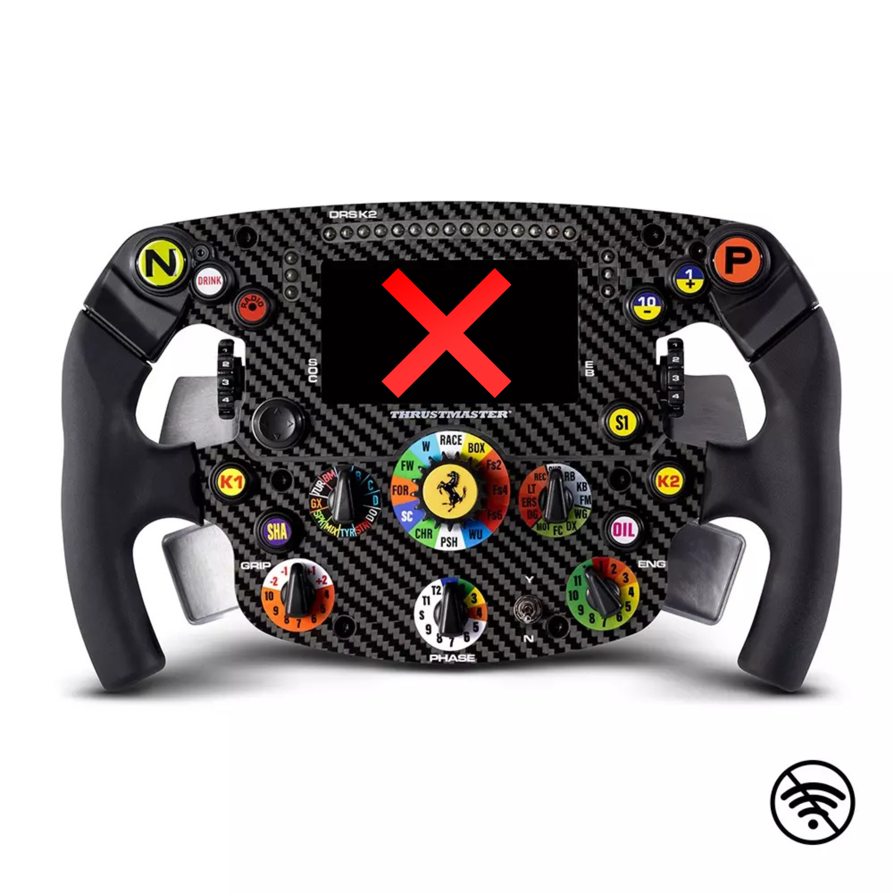

## About the Mod:
This adapter enables the SF1000 to be used as a standalone USB device on PC while incorporating a dual-clutch function with an adjustable bite point.
 

### IMPORTANT - Firmware Update Warning:
Do not update the wheel’s firmware via its USB-C port when the mod is installed, as this will brick the mod and void the warranty.

### IMPORTANT - Wheel Dash Compatibility:
You can use SimHub with the following plugin to enable dash display in most racing games: 
https://github.com/ducng99/SimHub-SF1000-UDP

The wheel must support the WiFi UDP protocol for the dash to display data.

### Dual Clutch Feature:

### Installation Tutorial: 
https://www.youtube.com/watch?v=WaNFpvcBrjo
