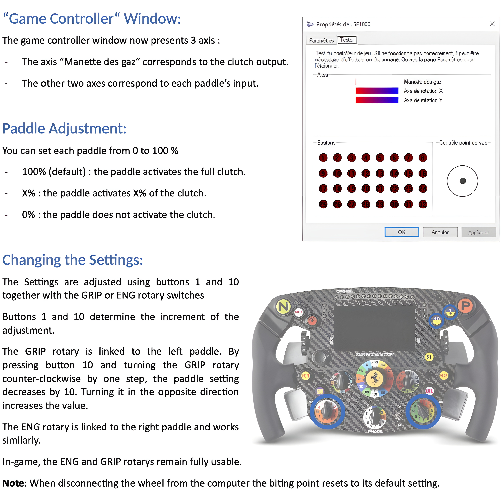

  
<strong>About the Mod:</strong>

  This adapter enables the SF1000 to be used as a standalone USB device on PC while incorporating a dual-clutch function with an adjustable bite point.

### IMPORTANT - Firmware Update Warning:
Do not update the wheel’s firmware via its USB-C port when the mod is installed, as this will brick the mod and void the warranty.

### Dual Clutch Feature:

### Installation Tutorial: 
https://www.youtube.com/watch?v=WaNFpvcBrjo
